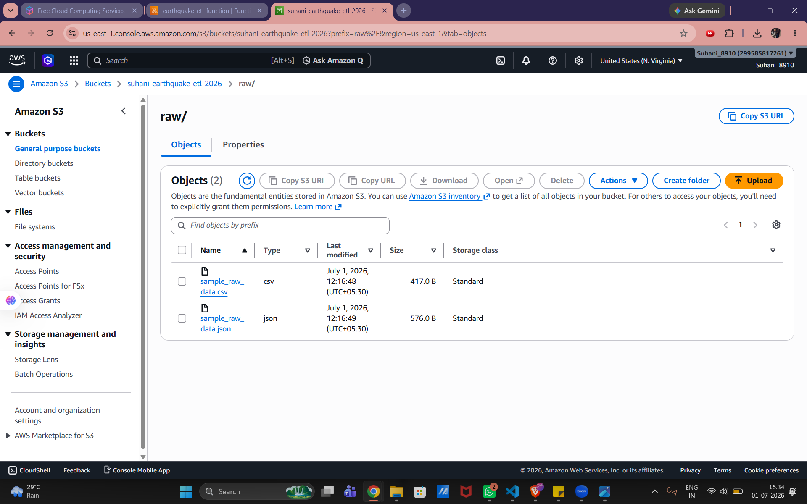
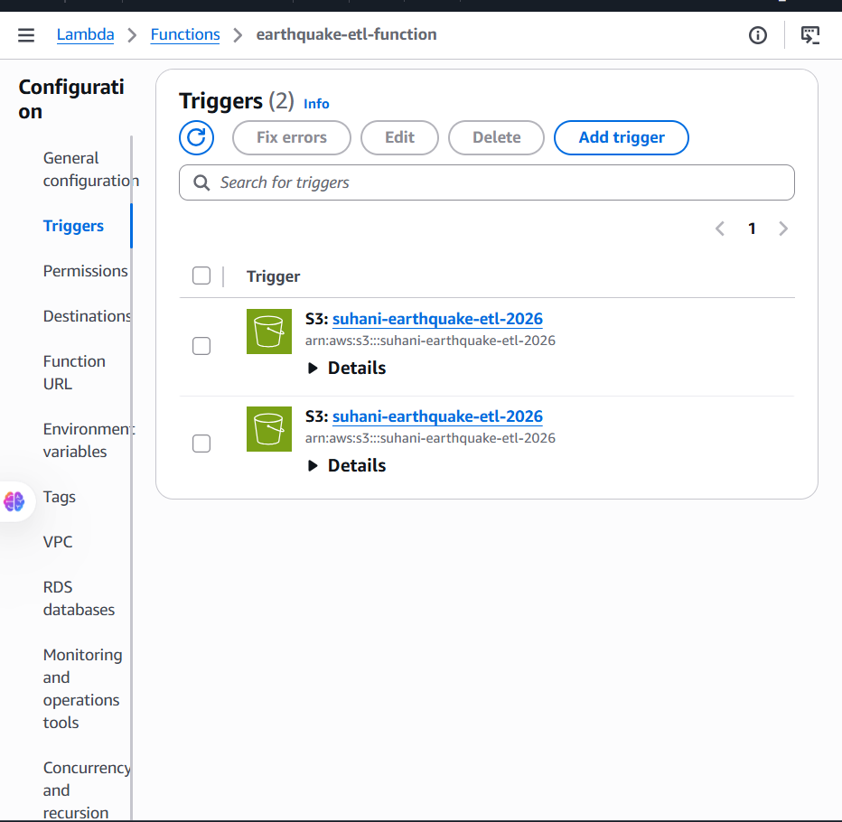
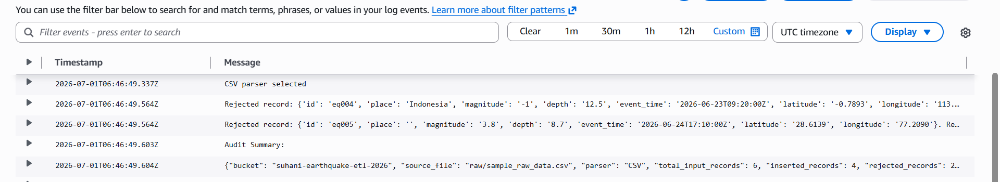
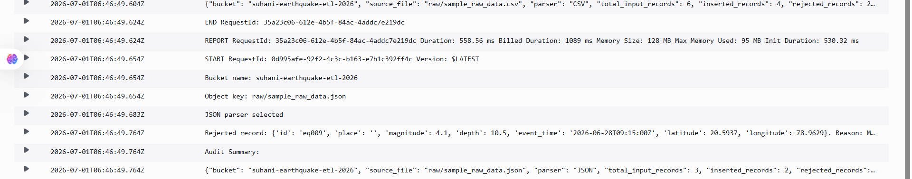
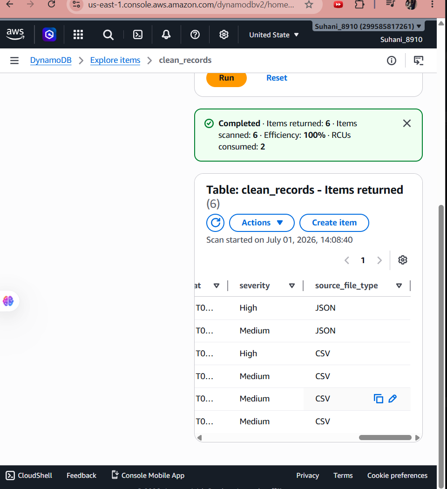
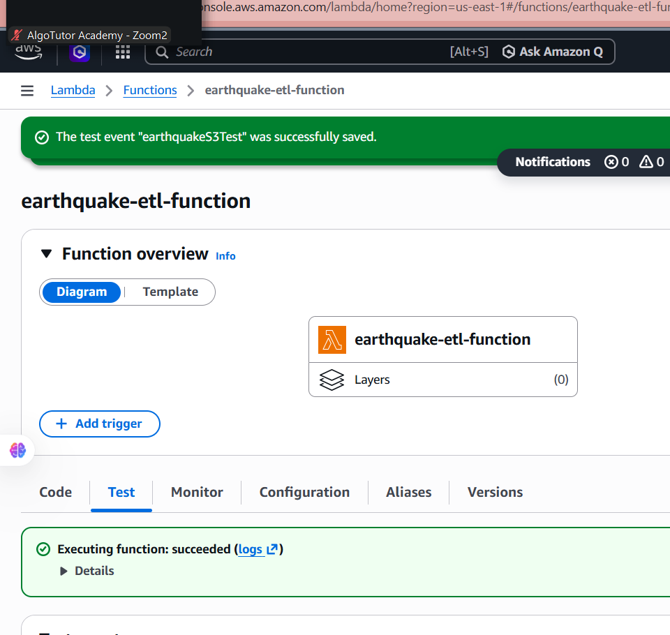
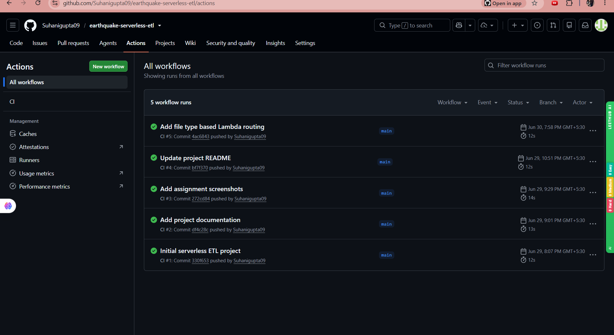
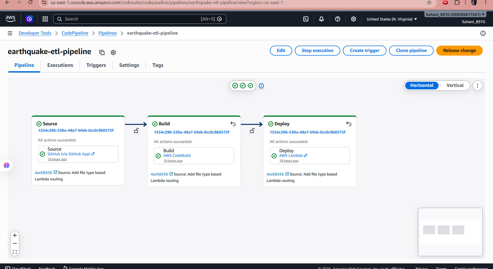

# 🌍 Earthquake Serverless ETL Pipeline


## About the Project

This project is a serverless ETL pipeline built using AWS services.

The idea is simple: earthquake data is uploaded to Amazon S3 in either CSV or JSON format. An AWS Lambda function automatically detects the file type, selects the correct parser, cleans the data, and stores valid records in Amazon DynamoDB.

Invalid records are rejected, while CloudWatch keeps a clear audit of how many records were received, inserted, and rejected.

The project also uses GitHub Actions and AWS CodePipeline to validate and deploy the Lambda code automatically.

---

## Why I Built This Project

Raw data is not always clean or available in one format.

A data engineering pipeline should be able to:

* accept data from different file formats
* validate incoming records
* reject incorrect values
* standardize fields
* create useful derived information
* store clean data in a database
* keep logs for monitoring

This project demonstrates all these steps using a small earthquake dataset.

---

## Architecture

```text
Earthquake CSV or JSON File
              |
              v
        Amazon S3 raw/
              |
              v
       AWS Lambda Function
              |
      Detect File Extension
        /             \
       v               v
  CSV Parser       JSON Parser
        \             /
         v           v
     Validate and Transform
              |
              v
 Amazon DynamoDB clean_records
              |
              v
    Amazon CloudWatch Logs
```

### CI/CD Flow

```text
GitHub Repository
        |
        v
GitHub Actions
        |
        v
AWS CodePipeline
        |
   Source → Build → Deploy
        |
        v
AWS Lambda Updated
```

---

## Main Features

* Serverless and event-driven architecture
* Automatic processing when a file is uploaded to S3
* CSV and JSON file support
* File-type-based parser selection
* Bucket and folder validation
* Invalid record rejection
* Standardized place names
* Derived earthquake severity field
* DynamoDB storage
* CloudWatch audit logging
* GitHub Actions validation
* AWS CodePipeline deployment

---

## AWS Services Used

| Service           | Purpose                                  |
| ----------------- | ---------------------------------------- |
| Amazon S3         | Stores raw CSV and JSON earthquake files |
| AWS Lambda        | Extracts, transforms, and loads the data |
| Amazon DynamoDB   | Stores clean earthquake records          |
| Amazon CloudWatch | Stores logs and audit summaries          |
| AWS IAM           | Controls access between AWS services     |
| AWS CodeBuild     | Validates the Python files               |
| AWS CodePipeline  | Automates source, build, and deployment  |

---

## Supported File Types

The Lambda function checks the uploaded file extension before processing.

| File type     | Parser selected |
| ------------- | --------------- |
| `.csv`        | CSV parser      |
| `.json`       | JSON parser     |
| Other formats | Rejected        |

```text
raw/sample_raw_data.csv  → CSV Parser
raw/sample_raw_data.json → JSON Parser
```

Only files uploaded to the following bucket and prefix are processed:

```text
Bucket: suhani-earthquake-etl-2026
Prefix: raw/
```

---

## ETL Process

### 1. Extract

The raw earthquake file is uploaded to:

```text
s3://suhani-earthquake-etl-2026/raw/
```

S3 automatically triggers the Lambda function.

### 2. Select Parser

The function checks the uploaded file name.

```python
if object_key.lower().endswith(".csv"):
    records = parse_csv(file_content)

elif object_key.lower().endswith(".json"):
    records = parse_json(file_content)

else:
    raise ValueError("Unsupported file type")
```

### 3. Transform

The Lambda function applies the following rules:

* Reject records with a missing earthquake ID
* Reject records with a missing place
* Reject records with a negative magnitude
* Convert place names to title case
* Convert numeric fields into valid numbers
* Add a `severity` field
* Add a `source_file_type` field
* Add a processing timestamp

### Severity Rules

| Magnitude    | Severity |
| ------------ | -------- |
| 6 or above   | High     |
| 4 to below 6 | Medium   |
| Below 4      | Low      |

### 4. Load

Valid records are inserted into the DynamoDB table:

```text
Table name: clean_records
Partition key: record_id
Capacity mode: On-demand
```

---

## Dataset Fields

| Field        | Meaning                    |
| ------------ | -------------------------- |
| `id`         | Unique earthquake ID       |
| `place`      | Location of the earthquake |
| `magnitude`  | Strength of the earthquake |
| `depth`      | Depth of the earthquake    |
| `event_time` | Time of the event          |
| `latitude`   | Latitude coordinate        |
| `longitude`  | Longitude coordinate       |

The transformed record also contains:

| New field          | Meaning              |
| ------------------ | -------------------- |
| `severity`         | High, Medium, or Low |
| `source_file_type` | CSV or JSON          |
| `processed_at`     | Processing timestamp |

---

## Test Results

### CSV File

```text
Total records: 6
Inserted records: 4
Rejected records: 2
```

Inserted:

```text
eq001
eq002
eq003
eq006
```

Rejected:

```text
eq004 → Negative magnitude
eq005 → Missing place
```

### JSON File

```text
Total records: 3
Inserted records: 2
Rejected records: 1
```

Inserted:

```text
eq007
eq008
```

Rejected:

```text
eq009 → Missing place
```

### Final DynamoDB Result

```text
Total clean records: 6
CSV records: 4
JSON records: 2
```

---

## Audit Logging

CloudWatch logs contain:

* source bucket
* source file name
* selected parser
* total input records
* inserted records
* rejected records
* timestamp

Example:

```json
{
  "bucket": "suhani-earthquake-etl-2026",
  "source_file": "raw/sample_raw_data.json",
  "parser": "JSON",
  "total_input_records": 3,
  "inserted_records": 2,
  "rejected_records": 1
}
```

---

## CI/CD Pipeline

### GitHub Actions

The workflow runs whenever code is pushed or a pull request is created.

It:

1. checks out the repository
2. sets up Python 3.11
3. installs dependencies
4. validates all Lambda Python files

```bash
python -m py_compile lambda_function.py
python -m py_compile router_lambda.py
python -m py_compile csv_processor.py
python -m py_compile json_processor.py
```

### AWS CodePipeline

The pipeline contains:

```text
Source → Build → Deploy
```

| Stage  | Work performed                           |
| ------ | ---------------------------------------- |
| Source | Reads code from the GitHub `main` branch |
| Build  | Uses CodeBuild to validate the code      |
| Deploy | Updates the AWS Lambda function          |

---

## Project Structure

```text
earthquake-serverless-etl/
│
├── .github/
│   └── workflows/
│       └── ci.yml
│
├── sample_data/
│   ├── sample_raw_data.csv
│   └── sample_raw_data.json
│
├── screenshots/
│   ├── 01_s3_raw_files.png
│   ├── 02_lambda_csv_json_triggers.png
│   ├── 03_csv_parser_cloudwatch.png
│   ├── 04_json_parser_cloudwatch.png
│   ├── 05_dynamodb_clean_records.png
│   ├── 06_lambda_execution_success.png
│   ├── 07_github_actions_success.png
│   └── 08_codepipeline_success.png
│
├── .gitignore
├── README.md
├── buildspec.yml
├── csv_processor.py
├── json_processor.py
├── lambda_function.py
├── requirements.txt
└── router_lambda.py
```

---

## Project Screenshots

### 1. CSV and JSON files stored in S3



Both raw file formats are stored inside the S3 `raw/` prefix.

---

### 2. CSV and JSON S3 triggers



Separate S3 suffix filters trigger the Lambda function for `.csv` and `.json` files.

---

### 3. CSV parser selected



CloudWatch confirms that the CSV parser was selected.

---

### 4. JSON parser selected



CloudWatch confirms that the JSON parser was selected and shows the audit result.

---

### 5. Clean records stored in DynamoDB



The table contains clean records from CSV and JSON sources.

---

### 6. Lambda execution successful



The Lambda function completed successfully.

---

### 7. GitHub Actions successful



The GitHub Actions workflow passed successfully.

---

### 8. AWS CodePipeline successful



Source, Build, and Deploy stages completed successfully.

---

## How to Test

### Test CSV

1. Open the S3 bucket
2. Open the `raw/` folder
3. Upload `sample_raw_data.csv`
4. Open the latest CloudWatch log stream
5. Confirm that `CSV parser selected` appears
6. Check DynamoDB

### Test JSON

1. Upload `sample_raw_data.json`
2. Open the latest CloudWatch log stream
3. Confirm that `JSON parser selected` appears
4. Check DynamoDB for `eq007` and `eq008`

---

## Security

The project does not store:

* AWS access keys
* AWS secret keys
* credentials
* `.env` files
* ZIP deployment packages

The S3 bucket blocks public access.

For this beginner project, AWS-managed policies were used. In a production project, these should be replaced with custom least-privilege IAM policies.

---

## Future Improvements

* Add XML and Parquet file support
* Store rejected records in a separate S3 folder
* Add SNS alerts for failed processing
* Add unit tests
* Add schema validation
* Add CloudWatch alarms
* Create infrastructure using Terraform or AWS SAM
* Build an earthquake analytics dashboard

---

## Final Outcome

This project successfully demonstrates:

* multi-format data ingestion
* CSV and JSON parser selection
* serverless ETL processing
* validation and transformation
* DynamoDB storage
* audit logging
* automated CI/CD deployment

---

## Author

**Suhani Gupta**

GitHub: [Suhanigupta09](https://github.com/Suhanigupta09)

Project Repository:
[Earthquake Serverless ETL Pipeline](https://github.com/Suhanigupta09/earthquake-serverless-etl)
